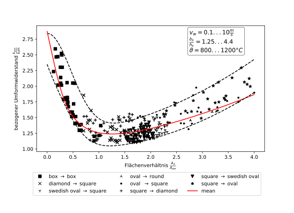
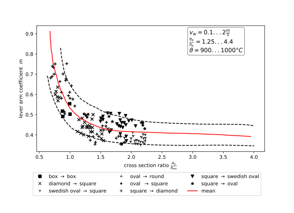

This plugin provides the empirical roll force and roll torque models developed by A. Hensel and coworkers[^1][^2]. The
models are empirical master curves dependent on the dimensionless parameter $A_\mathrm{d}/A_\mathrm{m}$, which is the
ratio of contact area to the mean cross-section area of the profiles. It is called the roll gap ratio hereinafter. It is
similar to the dimensionless parameters $R/h_1$ and $L_\mathrm{d}/h_\mathrm{m}$ often used in flat rolling.

## Model Approaches used in the Plugin

### Approach to roll force

The roll force is calculated by

$$ F = \frac{k_\mathrm{Wm}}{k_\mathrm{fm}} \times k_{\mathrm{fm}} \times A_{\mathrm{d}} $$

where $k_{\mathrm{fm}}$ is the mean flow stress, $A_{\mathrm{d}}$ the contact area and $k_\mathrm{Wm}$ the deformation
resistance. $k_\mathrm{Wm}/k_\mathrm{fm}$ is the inverse efficiency of the rolling process.

For the mean flow stress $k_{\mathrm{fm}}$ a weighted mean as below is used, since this provides a more suitable average
than simple arithmetic mean. The indices 0 and 1 denote the entry resp. exit side as usual.

$$ k_{\mathrm{fm}} = \frac{ \left( k_{\mathrm{f0}} + 2 k_{\mathrm{f1}} \right) }{3} $$

The similar is the case for the mean cross-section $A_\mathrm{m}$:

$$ A_{\mathrm{m}} = \frac{ \left( A_{\mathrm{0}} + 2 A_{\mathrm{1}} \right) }{3} $$

The value of $k_\mathrm{Wm}/k_\mathrm{fm}$ is obtained from the master curve in dependence on $A_\mathrm{d}/A_
\mathrm{m}$ as shown in the figure. The figure shows accordingly several experimental measured values and the hull
curves around all measurements. The red line is the weighted mean curve and is given by

$$ \frac{k_\mathrm{Wm}}{k_\mathrm{fm}} = 0.9901 + 0.106 \frac{A_\mathrm{d}}{A_\mathrm{m}} + 0.0283 \left( \frac{A_
\mathrm{d}}{A_\mathrm{m}} \right)^2 + 1.5718 \exp \left[ -2.4609 \frac{A_\mathrm{d}}{A_\mathrm{m}} \right] + 0.3117 \exp
\left[ -15.625 \left( \frac{A_\mathrm{d}}{A_\mathrm{m}} \right)^2 \right]
$$

### Approach to roll torque

The roll torque is calculated by

$$ M = F \times L_{\mathrm{d}} \times m $$

where $L_{\mathrm{d}}$ is the contact length and $m$ is the lever arm coefficient.

The dependence of the lever arm coefficient on $A_\mathrm{d}/A_\mathrm{m}$ is shown in the figure with experimental data
and their hull curves accordingly.

In additional dependence on the celsius workpiece temperature $\vartheta$ and rolling velocity $v$, $m$ can be
calculated by the following equation, as was implemented in the current case.

$$ m = \left( \exp \left[ -0.6 \frac{A_\mathrm{d}}{A_\mathrm{m}} \right] + 0.076 \frac{A_\mathrm{d}}{A_\mathrm{m}}
\right) v^{0.005} \exp \left[ -0.0003 \left( \vartheta - 900 \right) \right] $$

## Usage of the Plugin

The plugin provides implementations of the following core hooks:

`RollPass.roll_force`
:   The roll force occurring in this pass calculated by the models described above. Uses
the `RollPass.deformation_resistance` and `RollPass.contact_area` hooks.

`RollPass.Roll.roll_torque`
:   The roll torque occurring in this pass calculated by the models described above. Uses the `RollPass.roll_force`,
`RollPass.contact_length` and `RollPass.lever_arm_coefficient` hooks.

The following hooks are specified and implemented additionally:

`RollPass.roll_gap_ratio`
:   The ratio of contact area to cross-section $A_\mathrm{d}/A_\mathrm{m}$. Uses the core hooks `Profile.cross_section`
and `RollPass.contact_area`.

`RollPass.rolling_efficiency`
:   The efficiency of the rolling process, that means the inverse of $k_\mathrm{Wm}/k_\mathrm{fm}$ obtained from the
model shown above. Uses the `RollPass.roll_gap_ratio` hook.

`RollPass.deformation_resistance`
:   The deformation resistance $k_\mathrm{Wm}$ calculated using $k_\mathrm{Wm}/k_\mathrm{fm}$ and the mean flow stress
as described above. Uses the `RollPassProfile.flow_stress` and the `RollPass.rolling_efficiency` hooks.

`RollPass.lever_arm_coefficient`
:   The lever arm coefficient $m$ obtained from the model described above. Uses the `RollPass.roll_gap_ratio`,
`RollPass.velocity` and `Profile.temperature` hooks.

One can modify the behavior of the plugin by providing constant attributes or custom implementations of the hooks. The
plugin needs no additional material data or coefficients to be given on the initial profile or on the roll passes.
Commonly it should work out of the box, without additional definitions by the user.

[^1]:
Hensel, A., P. Poluchin, und W. Poluchin. Technologie der Metallformung. Deutscher Verlag für Grundstoffindustrie, 1990.

[^2]: Hensel, A., und T. Spittel. Kraft- und Arbeitsbedarf bildsamer Formgebungsverfahren. Deutscher Verlag für
Grundstoffindustrie, 1978.
